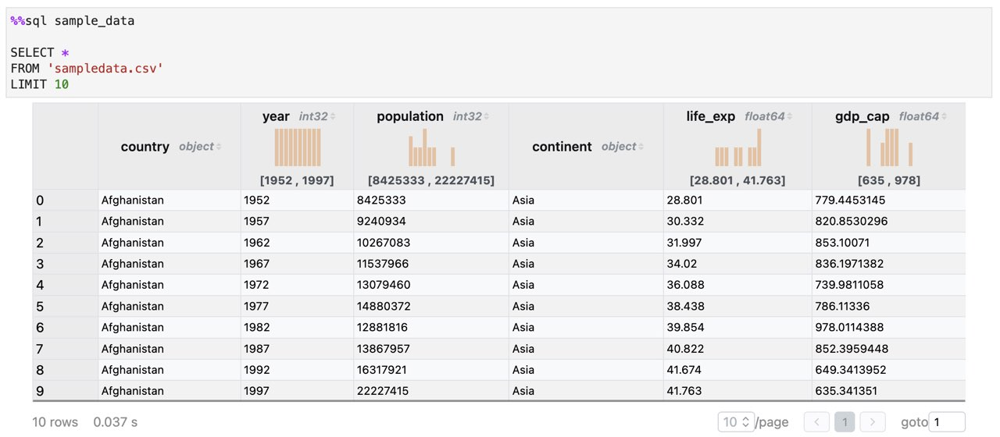

# Analytical SQL Cell

Analytical SQL cell for Jupyter.


## Installation

You can install using `pip`:

```bash
pip install asqlcell
```

## Quick Start

Here's a quick example to get you started with Analytical SQL Cell in Jupyter:

```%%sql result_set

SELECT 
    *
FROM 'data.csv'
LIMIT 10
```

In the above sample, `%%sql` is a cell magic indicating that the cell block will be executed as a SQL statement. The following `result_set` is required to be the name of Pandas dataframe holding the result set.

### Data Load

You can query from Pandas DataFrame, CSV files, compressed (e.g. compressed with gzip) CSV files, as well as Parquet files.

### SQL

DuckDB is the default engine of Analytical SQL Cell. Please find more details at the [SQL Introduction](https://duckdb.org/docs/sql/introduction) of DuckDB.

### Result Table

With the SQL query being executed in an Analytical SQL Cell, the result set is presented as a table.

In case of multiple SQL statements being executed in an Analytical SQL Cell, only the result set of the last SQL statement will be presented.

If the last SQL statement didn't have any result set, then only the count of executed data rows is shown. 



### Tutorial

 * [Introduction](examples/introduction.ipynb)
 * [World Development in Numbers](examples/gapminder.ipynb)

## Development

This widget is developed with conda to ensure a consistent developer experience. The project is developed in both
Mac OS and Windows Subsystem for Linux.

Please run the following commands to create a conda environment:

```bash
conda create -n asqlcell -c conda-forge nodejs yarn python jupyterlab
conda activate asqlcell
```

### Python

Install the python. This will also build the TypeScript package.

```bash
pip install -e ".[test, examples, docs]"
```

### Jupyter

When developing your extensions, you need to manually enable your extensions with the notebook / lab frontend. 

For lab, this is done by the command:

```
jupyter labextension develop --overwrite .
jlpm run build
```

For classic notebook, you need to run:

```
jupyter nbextension install --sys-prefix --symlink --overwrite --py asqlcell
jupyter nbextension enable --sys-prefix --py asqlcell
```

Note that the `--symlink` flag doesn't work on Windows, so you will here have to run
the `install` command every time that you rebuild your extension. For certain installations
you might also need another flag instead of `--sys-prefix`, but we won't cover the meaning
of those flags here.

#### Typescript

You must start watching the change of the widget:

```bash
jlpm run watch
```

Then in another terminal you can run Jupyter Lab (without launching a browser):

```bash
jupyter lab --no-browser
```

Now you can open Google Chrome and navigate to [http://localhost:8888](http://localhost:8888) to play with the widget.
After a change wait for the build to finish and then refresh your browser and the changes should take effect.

If you make a change to the python code then you will need to restart the notebook kernel to have it take effect.
